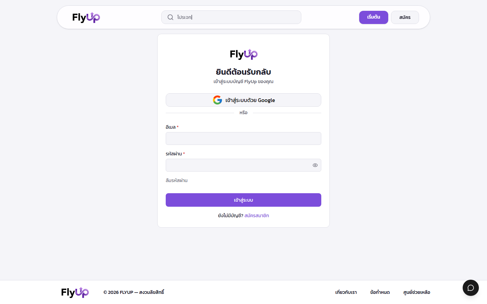
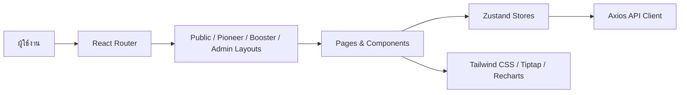
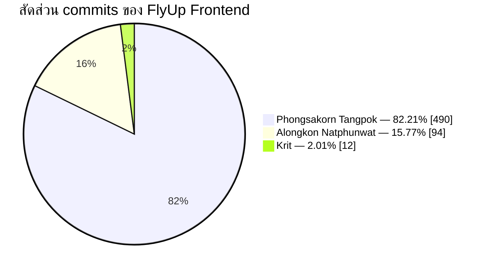

<div align="center">
  

  # FlyUp

  **แพลตฟอร์มระดมทุนสำหรับโปรเจกต์ซอฟต์แวร์ของนักศึกษา**

  เปิดพื้นที่ให้เจ้าของไอเดียสร้างโปรเจกต์ ระดมทุนเป็นขั้นตอนผ่าน Milestone<br />
  และให้ผู้สนับสนุนติดตามความคืบหน้า โหวต และรับส่วนแบ่งกำไรได้ในระบบเดียว

  [](https://react.dev/)
  [](https://www.typescriptlang.org/)
  [](https://vite.dev/)
  [](https://tailwindcss.com/)
  [](https://www.docker.com/)
</div>

---

## ภาพตัวอย่างโปรเจกต์

### หน้าแรก


<table>
  <tr>
    <td width="50%" align="center"><strong>Authentication</strong></td>
    <td width="50%" align="center"><strong>FlyUp Experience</strong></td>
  </tr>
  <tr>
    <td></td>
    <td align="center"></td>
  </tr>
</table>

## FlyUp ทำอะไรได้บ้าง

- **ค้นหาและสำรวจโปรเจกต์** — ค้นหา กรองหมวดหมู่ และติดตามยอดระดมทุนแบบสาธารณะ
- **สร้างโปรเจกต์แบบเป็นขั้นตอน** — กรอกข้อมูล เรื่องราว Milestone ข้อตกลง และอัปเดตโครงการ
- **ลงทุนและชำระเงิน** — รองรับขั้นตอนการลงทุนและแสดง QR payment จาก API
- **Milestone & Voting** — ส่งผลงานตามงวด ให้ผู้ลงทุนตรวจสอบและโหวต
- **ประชุมและติดตามความคืบหน้า** — จัดการนัดหมาย ข่าวสาร และการสื่อสารระหว่างทีม
- **ผลตอบแทนและการเบิกจ่าย** — ติดตามกำไร การจ่ายเงิน และคำขอคืนเงิน
- **ระบบร้องเรียน** — เปิดเคส ติดตามสถานะ และตรวจสอบโดยผู้ดูแลระบบ
- **Dashboard แยกตามบทบาท** — รองรับ Pioneer, Booster และ Admin
- **Authentication** — Email/password, JWT และ Google OAuth
- **Responsive UI** — รองรับ desktop, tablet และ mobile

## บทบาทในระบบ

| บทบาท | ความสามารถหลัก |
|---|---|
| **Pioneer** | สร้างและแก้ไขโปรเจกต์ จัดการ Milestone การประชุม การเบิกจ่าย และกำไร |
| **Booster** | ลงทุน ติดตามพอร์ต โหวต Milestone ประชุม รับผลตอบแทน คืนเงิน และร้องเรียน |
| **Admin** | อนุมัติโปรเจกต์/ตัวตน/Milestone จัดการผู้ใช้ การเงิน หมวดหมู่ มหาวิทยาลัย และ Audit Log |
| **Guest** | ดูหน้าแรก ค้นหาโปรเจกต์ อ่านรายละเอียด และสมัครสมาชิก |

## ภาพรวมสถาปัตยกรรม



- Frontend application: **React 19 + TypeScript + Vite**
- State management: **Zustand**
- Styling: **Tailwind CSS**
- Rich-text editor: **Tiptap**
- Charts: **Recharts**

## Tech Stack

<div align="center">
  
</div>

| Layer | Technologies |
|---|---|
| Frontend | React 19, TypeScript, Vite, Tailwind CSS |
| UI & Content | Lucide React, React Icons, Tiptap, SweetAlert2 |
| State & Data | Zustand, Axios, React Router, SSE |
| Visualization | Recharts |
| Testing | Vitest, Testing Library, jsdom |
| Tooling | ESLint, TypeScript ESLint, Vite |
| Deployment | Docker, Docker Compose, Nginx |

## เริ่มต้นใช้งาน

### สิ่งที่ต้องมี

- Node.js 20+
- npm
- API endpoint ของ FlyUp ที่พร้อมใช้งาน
- Docker และ Docker Compose (ทางเลือก)

### รัน Frontend

```bash
git clone https://github.com/011-Boom-Phongsakorn/flyup.git
cd flyup
npm install
cp .env.example .env
```

กำหนด URL ของ API ใน `.env`:

```env
VITE_BASE_URL=http://localhost:8080
```

จากนั้นเริ่ม development server:

```bash
npm run dev
```

เปิด [http://localhost:5173](http://localhost:5173)

### รันด้วย Docker

```bash
docker compose up --build
```

> ฟีเจอร์ที่ต้องใช้ข้อมูลจริงจำเป็นต้องกำหนด `VITE_BASE_URL` ให้ชี้ไปยัง API ที่พร้อมใช้งาน

## คำสั่งที่ใช้บ่อย

| คำสั่ง | รายละเอียด |
|---|---|
| `npm run dev` | เปิด Vite development server |
| `npm run build` | ตรวจ TypeScript และสร้าง production build |
| `npm run preview` | ดู production build ในเครื่อง |
| `npm run lint` | ตรวจรูปแบบและข้อผิดพลาดของโค้ด |
| `npm run test:run` | รันชุดทดสอบด้วย Vitest |

## โครงสร้างโปรเจกต์

```text
flyup/
├── docs/images/          # ภาพประกอบ README
├── public/               # Static assets และภาพแบรนด์
├── src/
│   ├── components/       # UI และ shared components
│   ├── hooks/            # Custom React hooks
│   ├── layouts/          # Layout แยกตามบทบาท
│   ├── lib/              # Utilities และ business helpers
│   ├── pages/            # Public, Pioneer, Booster และ Admin pages
│   ├── routes/           # Route configuration และ guards
│   ├── services/         # API client
│   ├── store/            # Zustand stores
│   └── test/             # Test setup
├── Dockerfile
├── docker-compose.yml
├── nginx.conf
└── package.json
```

## Contributors

<div align="center">
  <a href="https://github.com/011-Boom-Phongsakorn">
    
  </a>
  &nbsp;&nbsp;&nbsp;
  <a href="https://github.com/SundayYogurt">
    
  </a>
  &nbsp;&nbsp;&nbsp;
  <a href="https://github.com/nine9031">
    
  </a>
  <br />
  <strong>Phongsakorn Tangpok</strong>
  &nbsp;&nbsp;•&nbsp;&nbsp;
  <strong>Krit</strong>
  &nbsp;&nbsp;•&nbsp;&nbsp;
  <strong>Alongkon Natphunwat</strong>
</div>

### Commit Distribution

| Contributor | GitHub | Commits | สัดส่วน |
|---|---|---:|---:|
| Phongsakorn Tangpok | [@011-Boom-Phongsakorn](https://github.com/011-Boom-Phongsakorn) | **490** | **82.21%** |
| Alongkon Natphunwat | [@nine9031](https://github.com/nine9031) | **94** | **15.77%** |
| Krit | [@SundayYogurt](https://github.com/SundayYogurt) | **12** | **2.01%** |
| **รวม** |  | **596** | **100%** |



> สถิติคำนวณจาก `git log --all` ของ repository `flyup` ณ วันที่ **17 กันยายน 2026** โดยรวมชื่อและอีเมล commit หลายรูปแบบของบุคคลเดียวกันแล้ว ตัวเลข commits ใช้แสดงกิจกรรมใน Git เท่านั้น ไม่ใช่ตัววัดปริมาณหรือคุณค่าของงานทั้งหมด

## Contributing

ยินดีรับการปรับปรุงผ่าน Pull Request:

1. Fork repository
2. สร้าง branch จาก `develop`
3. แก้ไขและตรวจสอบด้วย `npm run lint` และ `npm run build`
4. Commit ด้วยข้อความที่อธิบายการเปลี่ยนแปลงชัดเจน
5. Push branch และเปิด Pull Request กลับมายัง `develop`

ตัวอย่างชื่อ branch:

```text
feature/project-bookmark
fix/footer-scroll-snap
docs/update-readme
```

รูปแบบ commit ที่แนะนำ:

```text
feat: add project bookmark
fix: prevent nested page scrolling
docs: update contributor statistics
refactor: simplify project store
test: add investment form coverage
```

## License

ขณะนี้ repository ยังไม่ได้ระบุ license สำหรับการนำโค้ดไปใช้ซ้ำหรือเผยแพร่ต่อ กรุณาติดต่อทีมพัฒนาก่อนนำไปใช้งานภายนอก

---

<div align="center">
  Made with 💜 by the FlyUp team
</div>
